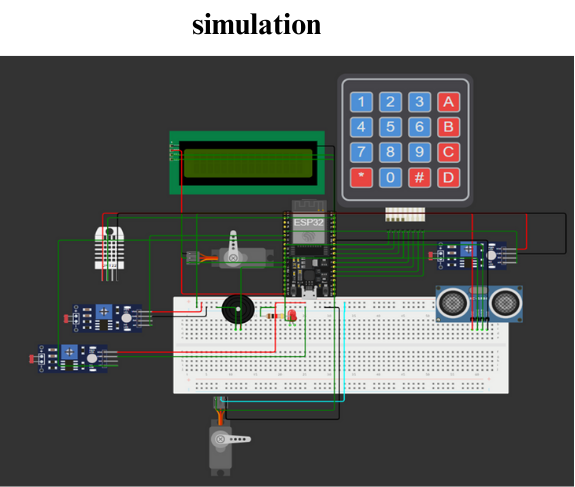

# IoT Smart Home Automation 🏠⚡

## 📌 Overview

This project is an **IoT-based smart home system** integrating multiple automation features with real-time monitoring and control.
It combines **hardware sensors & actuators**, **MQTT protocol**, **Firebase integration**, and a **Flutter mobile app** to provide:

* Secure authentication & notifications
* Automated home control (lighting, rain detection, fire detection, etc.)
* Real-time environment monitoring
* Seamless mobile-based control

---

## 🛠️ Key Features & Technologies

### 🔐 Secure Authentication & Access Control

* Keypad-based access system with servo-controlled door
* LCD user interaction display
* Alarm triggered on multiple failed attempts
* Firebase Authentication integration for mobile app login

### 🔥 Fire Detection & Safety

* Flame sensor detects fire hazards
* Alarm (buzzer) triggered upon fire detection
* Push notification sent to mobile app via Firebase

### 💡 Motion Detection & Smart Lighting

* LDR sensor measures ambient light levels
* Automatic LED control based on motion & light
* Manual override through Flutter app

### 🌧️ Rain Detection & Automated Window Control

* Servo motor automatically closes windows during rain
* Real-time rain dataset published via MQTT

### 🌡️ Environmental Monitoring

* DHT11 sensor monitors temperature & humidity
* Data published to MQTT broker for remote monitoring
* Real-time updates displayed in the Flutter app

### 📡 Communication & Backend

* **ESP32 microcontroller** for WiFi-based communication
* **MQTT protocol** for real-time device-to-device messaging
* Automatic reconnection & remote control via MQTT commands
* **Firebase Realtime Database** for data logging & history

---

## 📲 Mobile App (Flutter)

* **User Authentication** (Firebase Auth)
* **Real-time Dashboard** (Temp, Humidity, Rain, Motion, Fire)
* **Notifications** for fire/rain/security alerts
* **Control Panel** for lights, door, and window automation


## 🖼️ Project Screenshots & Simulation

### 🔧 Hardware Prototype (Makiet)


### ⚡ Proteus / Tinkercad / Dynamo Simulation



### 📱 Flutter App Screens


## 🚀 Installation & Setup

### Hardware

1. Upload ESP32 code from `hardware/esp32_code.ino`
2. Connect sensors (DHT11, Flame sensor, LDR, Rain sensor) and actuators (servo, LED, buzzer).

### Flutter App

```bash
cd flutter_app
flutter pub get
flutter run
```

### Backend Setup

* Create Firebase project → Enable Authentication & Realtime Database.
* Configure MQTT broker (e.g., Mosquitto / HiveMQ).
* Update broker credentials in ESP32 code and Flutter app.

---

## ✅ Outcomes

* Fully functional IoT Smart Home system
* Real-time monitoring & remote control via Flutter app
* Secure authentication with Firebase
* Push notifications for fire/rain/security alerts
* Integration of hardware automation & cloud services

-
